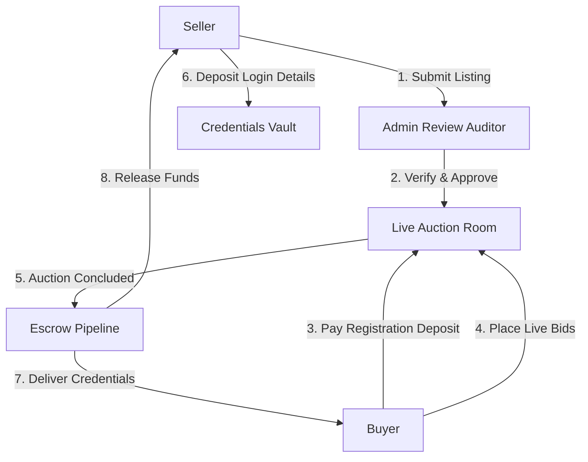

# Pokémon GO Auction Platform - Purpose & Overview

Welcome to the **Pokémon GO Auction Platform**. This document outlines the purpose of the platform, the problems it solves, its key functional areas, user roles, and core operational mechanics.

---

## 1. Executive Summary & Core Purpose

The **Pokémon GO Auction Platform** is a specialized, secure, real-time marketplace designed specifically for the auctioning and exchange of high-value Pokémon GO trainer accounts and digital assets. 

Unlike traditional open marketplaces or forum boards where account trading is prone to scamming, chargebacks, and misrepresentation, this platform acts as an **intermediary escrow agent and moderator**. It provides a structured environment where:
* Sellers can list verified accounts with detailed in-game resource metrics.
* Buyers can bid in real-time with confidence, backed by deposit-based participation constraints and strict admin oversight.
* The actual exchange of account credentials and funds is processed through a secure, step-by-step custody (escrow) pipeline.

---

## 2. Key Problems Solved

### A. Verification & Fraud Prevention
* **The Problem:** Sellers frequently lie about account statistics (e.g., inflating levels, Stardust, or Shiny counts) or upload stolen screenshots.
* **The Solution:** The platform enforces an admin-moderated listing review. Admins cross-check all submitted metadata against uploaded screenshots in a side-by-side auditor view before any auction goes live.

### B. Transactional Security (Escrow Custody)
* **The Problem:** Direct buyer-to-seller account handovers often lead to one party stealing the other's assets or money.
* **The Solution:** A secure **Credentials Vault** and escrow pipeline. The seller submits their account credentials directly to the platform. The platform secures them, verifies custody, facilitates payment capturing, delivers the credentials to the buyer, and only then releases the payout split to the seller.

### C. Defaulting Bidders (Trolling & Bid Snipping)
* **The Problem:** Bidders win auctions but refuse to pay, wasting weeks of the seller's time.
* **The Solution:** Bidders must pay a registration fee/deposit (e.g., ₹199) to bid on an auction. If a winning bidder fails to pay within 24 hours:
  1. Their deposit is forfeited.
  2. Their platform account is suspended.
  3. The **Runner-Up Cascade Engine** automatically assigns the win to the second-highest bidder, extending the clock by 24 hours to keep the auction viable.

---

## 3. Core Roles & Portals

### A. Sellers
* **Listing Submission:** Upload detailed account telemetry including:
  * Level & XP
  * Stardust & Pokecoins
  * Team alignment (Mystic, Valor, Instinct, or None)
  * Unique Pokémon counts (Shiny, Legendary, Mythical, Best Buddies, Pokédex completion)
  * Valuable inventory items (Rare Candies, Fast/Charged/Elite TMs, Raid Passes, Lure Modules, Incubators)
  * Proof of ownership screenshots
* **Dashboard:** Track live auctions, submit credentials upon winning, and request payout releases.

### B. Buyers / Bidders
* **Catalog Browsing:** Filter and search active auctions based on level, team, shiny count, and region.
* **Auction Registration:** Unlock bidding access by depositing a registration fee (facilitated securely through payment processors like Razorpay).
* **Live Bidding Room:** Place bids dynamically with instant price updates and automated countdown timer checks.

### C. Platform Administrators
* **Review Auditor:** Verify pending listings, correct seller typos inline, and approve/reject entries.
* **Live Room Kill Switch:** Pause, resume, rollback bids, or force-close live auctions in case of coordinated raids, typos, or exploits.
* **Escrow Managers:** Store sensitive login credentials, update custody states, and authorize seller payouts.
* **Webhook Watchdogs:** Monitor payment feeds, verify idempotency, and run manual payment synchronizations.

---

## 4. Operational Modules & Workflows

For detailed instructions on administrator actions, refer to the [Admin Operations Guide](file:///run/media/sourav/New%20Volume/Projects/pokemon-go-auction-website/docs/admin-guide.md).

* **Module 1: Auditor Review** - Dual-pane workspace aligning forms with a screenshot carousel to guarantee metadata authenticity.
* **Module 2: Live Room Controls** - Real-time websocket synchronizations supporting pausing, bid rollbacks, and countdown adjustments.
* **Module 3: Escrow Pipeline & Credentials Vault** - State-driven secure database custody that moves listings from `Live` -> `Awaiting Payment` -> `Credentials Secured` -> `Credentials Delivered` -> `Funds Released`.
* **Module 4: Cascade Engine** - Automated database cascades triggered upon payment timeouts, protecting sellers and genuine runner-up bidders.
* **Module 5: Razorpay Webhook Watchdog** - Logging and self-healing mechanisms for transaction hooks, resolving payment state discrepancies immediately.

---

## 5. Technology Stack

* **Frontend & Backend SSR:** [Next.js](https://nextjs.org/) (React 19, TypeScript)
* **Real-time Comms:** Socket.io client-server sync
* **Database & ODM:** MongoDB via Mongoose
* **State Management & Animations:** Zustand & Framer Motion
* **Payments & Escrow:** Razorpay API / Webhook Integration
* **Identity & Authentication:** NextAuth.js
